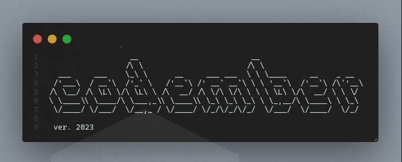

# codember

## My solutions to codember 2023

### prerequisites
 -Node js & git

### How to run?
```bash
   #clone repository
   https://github.com/V0XTO/codember.git

   cd codember

   #change directory to CHALLENGE_01
   cd CHALLENGE_01

   #Run solution
   node CHALLENGE_01.js
```

